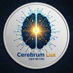

# Cerebrum Lux (Işık Beyin)



[](https://opensource.org/licenses/MIT)

**Giriş:**

Cerebrum Lux, mevcut yapay zeka paradigmalarını aşan, **kendi kendini geliştiren (meta-evrim), adapte olabilen ve zamanla insan zekasına benzer karmaşık görevleri başarıyla yerine getirebilen, yepyeni bir yapay zeka (AI) sistemi inşa etme vizyonuyla hareket eden öncü bir açık kaynak projesidir.** Kişisel bir dizüstü bilgisayar veya cep telefonu gibi sınırlı kaynaklara sahip cihazlarda dahi ultra-verimli bir şekilde çalışabilen, sıradışı ve dinamik bir AI modeli yaratmayı hedefliyoruz. Bu proje, sadece bir araştırma değil; **somut, devrim niteliğinde bir mühendislik ve geliştirme çabasıdır.**

---

## **Vizyon ve Temel Felsefe:**

Cerebrum Lux, statik öğrenme modellerinin ötesine geçerek, **nefes alan, canlı bir AI modeli** olmayı amaçlar. Temel felsefemiz, ultra-verimli, adaptif, esnek ve modüler bir mimari ile sıfırdan kendi özgün kodlarımızı geliştirerek, kısıtlı kaynaklarla maksimum zeka ve otonomi sağlamaktır.

**Kilit Kavramlar:**

*   **Meta-Evrim:** Cerebrum Lux, kendi algoritmik yapılarını ve temel kod tabanını **kendi kendini güncelleyerek ve optimize ederek** zamanla daha gelişmiş bir AI'a dönüşme yeteneğine sahip olacaktır. Bu, sadece parametre ayarlamadan öte, AI'ın kendini yeniden tasarlamasını içerir.
*   **Kriptofigler:** Bilgiyi, yoğunlaştırılmış ve anlamsal imzalar şeklinde "kriptofig" olarak temsil eder ve aktarırız. Bu kriptofigler, duyusal verilerden öğrenme modellerine, hatta mimari prensiplere kadar her şeyi kodlayabilir. AI'lar arası kriptografik yoğun bilgi transferi, çok az maliyetle ve çok az zamanda hızlı bir kolektif öğrenme ve evrim potansiyeli sunar.
*   **Adaptif İletişim:** AI, kullanıcının etkileşim performansını ve bağlamı analiz ederek, kendi iletişim tarzını (dilin direktliği, ton, detay seviyesi, onay isteme sıklığı) dinamik olarak ayarlayabilen bir modüle sahip olacaktır. Bu, insan-AI etkileşimini optimize etmeyi hedefler.
*   **Öz-Denetim ve Meta-Yönetim:** Cerebrum Lux, "Proje Felsefesi/Prensip Modülü" tarafından yönlendirilecek, "Etki Analizi ve Simülasyon Motoru" ile potansiyel değişikliklerin sistem genelindeki etkilerini öngörecek ve "Meta-Hedef Yöneticisi" ile kendi gelişim hedeflerini sürekli olarak değerlendirecektir. Bu, AI'ın "bilgece" ve disiplinli bir şekilde gelişmesini sağlar.

---

## **Projenin Mevcut Durumu:**

Cerebrum Lux projesinin temel altyapısı ve ana AI bileşenleri başarıyla entegre edilmiştir.

*   **Derlenebilirlik ve Stabilite:** Proje kodu şu anda tamamen derlenebilir durumdadır. `CerebrumLuxGUI.exe`, `nlp_online_trainer.exe` ve `test_response_engine.exe` uygulamaları sorunsuz çalışmaktadır.
*   **GUI Entegrasyonu ve Stabilite:** Qt6 tabanlı GUI arayüzü başarıyla entegre edilmiş ve stabil bir şekilde çalışmaktadır. Tüm loglar GUI'deki `LogPanel`'e akmakta olup, `LogPanel`, `GraphPanel`, `SimulationPanel` ve `Capsule Transfer Panel` gibi paneller işlevseldir.
*   **Sinyal İşleme:** Klavye, fare ve diğer sensörlerden (simüle edilmiş) gelen veriler işlenerek `DynamicSequence` yapısında `statistical_features_vector` ve `latent_cryptofig_vector` olarak temsil edilmektedir.
*   **Niyet Analizi ve Öğrenme:** `IntentAnalyzer`, `IntentLearner` (bağlamsal ve açık geri bildirim ile), `IntentTemplate` bileşenleri aktif olarak çalışmaktadır.
*   **Tahmin ve Planlama:** `PredictionEngine` (durum grafiği ile), `GoalManager` ve `Planner` temel işlevlerini yerine getirmektedir.
*   **Yanıt Üretimi (`ResponseEngine` - Gelişmiş):** Kullanıcının niyeti, soyut durumu, hedefi ve kriptofig verilerine göre bağlamsal ve dinamik metin tabanlı yanıtlar üretebilmektedir. `NaturalLanguageProcessor` sınıfı entegre edilmiştir.
*   **İçgörü Üretimi:** `AIInsightsEngine`, kullanıcı davranışları ve sistem durumundan anlamlı içgörüler üretebilmektedir.
*   **Kriptofig İşleme ve Derin Öğrenme:** `CryptofigProcessor` ve `CryptofigAutoencoder` entegre edilmiş olup, veri dönüşümü ve öğrenme mekanizmaları için temel sağlamaktadır. `AtomicSignal` yapısı genişletilmiş ve yeni sensörleri simüle edebilmektedir.
*   **Pekiştirmeli Öğrenme (Reinforcement Learning) Entegrasyonu:** `SuggestionEngine`'a `StateKey` struct'ı ve Q-tablosu (q_table) eklenmiştir. `IntentLearner::process_explicit_feedback` metodu `SuggestionEngine::update_q_value` metodunu çağırarak RL döngüsünü tetikler.
*   **Meta-Yönetim Katmanları:** `MetaEvolutionEngine` sınıfı meta-evrim ve öz-denetim için merkezi koordinatör olarak oluşturulmuştur.
*   **Kullanıcı Profili ve Kişiselleştirme:** `UserProfileManager` sınıfı kullanıcı tercihlerini, alışkanlıklarını ve geri bildirimleri yönetir.
*   **Learning Module & KnowledgeBase Entegrasyonu:** `Capsule`, `KnowledgeBase`, `LearningModule`, `WebFetcher` sınıfları entegre edilmiştir. `LearningModule` AIInsightsEngine'dan gelen içgörüleri Capsule'lara dönüştürür ve KnowledgeBase'e kaydeder. KnowledgeBase JSON formatında kalıcı veri tutar.
*   **Güvenli ve Akıllı Kapsül Transferi Modülü:** Yeni `Capsule` yapısı, kriptografik ve meta-veri alanlarını içerecek şekilde güncellenmiştir. `KnowledgeBase` API'si revize edilmiş, `LearningModule` içerisinde AES-256-GCM (şifreleme/şifre çözme) ve Ed25519 (imzalama/doğrulama) için OpenSSL API'leri kullanılarak implementasyonlar sağlanmıştır. `UnicodeSanitizer` ve `StegoDetector` entegrasyonu tamamlanmıştır. `CapsuleTransferPanel` GUI'ye entegre edilmiştir ve test senaryolarında beklenen şekilde çalışmaktadır.
*   **Altyapısal Gelişmeler:** `std::string` standardizasyonu, geliştirilmiş `Logger` sınıfı, merkezileştirilmiş `SafeRNG`, `CMakeLists.txt` optimizasyonları ve `VSCode Debug` yapılandırmaları tamamlanmıştır.

---

## **Kurulum ve Derleme:**

Cerebrum Lux'ı derlemek ve çalıştırmak için aşağıdaki adımları izleyin:

**Ön Gereksinimler:**

*   [MinGW-w64](https://mingw-w64.org/doku.php) (C++ derleyicisi)
*   [CMake](https://cmake.org/download/) (Derleme sistemi)
*   [Git](https://git-scm.com/downloads) (Depoyu klonlamak için)
*   [Qt6](https://www.qt.io/download) (GUI için)
*   [vcpkg](https://vcpkg.io/en/getting-started) (OpenSSL kurulumu için önerilir)
    *   `vcpkg install openssl:x64-mingw-static` komutu ile OpenSSL'i kurmanız tavsiye edilir.

**Adımlar:**

1.  **Depoyu Klonlayın:**
    ```bash
    git clone https://github.com/algoritma/CerebrumLux.git
    cd CerebrumLux
    ```
2.  **Derleme Dizini Oluşturun ve Yapılandırın:**
    ```bash
    Remove-Item -Recurse -Force build
    mkdir build
    cd build
cmake .. -G "MinGW Makefiles" `
    -DCMAKE_C_COMPILER="C:/Qt/Tools/mingw1310_64/bin/gcc.exe" `
    -DCMAKE_CXX_COMPILER="C:/Qt/Tools/mingw1310_64/bin/g++.exe" `
    -DCMAKE_PREFIX_PATH="C:/Qt/6.9.2/mingw_64" `
    -DCMAKE_TOOLCHAIN_FILE="C:/vcpkg/scripts/buildsystems/vcpkg.cmake" `
    -DVCPKG_TARGET_TRIPLET=x64-mingw-static
    ```
3.  **Projeyi Derleyin:**
    ```bash
    mingw32-make -j
    ```
    *(Alternatif olarak, Windows'ta `make` komutu da çalışabilir, MinGW kurulumunuza bağlı olarak.)*

4.  **GUI Uygulaması İçin DLL'leri Dağıtın:**
    `CerebrumLuxGUI.exe`'nin bulunduğu derleme dizinine (`build/Release` veya `build/Debug` gibi) gidin ve aşağıdaki komutu çalıştırın:
    ```bash
    windeployqt.exe CerebrumLuxGUI.exe
    ```
    Bu adım, GUI uygulamasının çalışması için gerekli tüm Qt DLL'lerini kopyalayacaktır.

5.  **Çalıştırın:**
    Ana uygulamayı çalıştırmak için:
    ```bash
    ./CerebrumLuxGUI.exe
    ```
    Testleri çalıştırmak için:
    ```bash
    ./test_response_engine.exe
    ```
    NLP eğiticisini çalıştırmak için:
    ```bash
    ./nlp_online_trainer.exe
    ```
    *(Not: Windows konsolunda Türkçe karakterlerin doğru görünmesi için, terminalinizin kodlamasını UTF-8 olarak ayarlamanız gerekebilir.)*

---

## **Katkıda Bulunma:**

Cerebrum Lux, açık kaynak bir projedir ve her türlü katkıya açıktır! Eğer projemizi geliştirmeye ilgi duyuyorsanız:

1.  Depoyu forklayın.
2.  Yeni bir dal (branch) oluşturun (`git checkout -b ozellik/yeni-ozellik`).
3.  Değişikliklerinizi yapın.
4.  Kod stil rehberimize uyun (*).
5.  Yeni özellikler için testler yazın.
6.  Değişikliklerinizi commit edin (`git commit -m "Ozellik: Yeni ozellik eklendi"`).
7.  Dalınızı push edin (`git push origin ozellik/yeni-ozellik`).
8.  Bir Pull Request (Çekme İsteği) oluşturun.

---

## **Lisans:**

Bu proje [MIT Lisansı](https://opensource.org/licenses/MIT) altında lisanslanmıştır. Daha fazla bilgi için `LICENSE` dosyasına bakın.

---

## **Gelecek Planlar ve Yol Haritası:**

Cerebrum Lux, iddialı hedeflere sahip, uzun vadeli bir projedir. Gelecek planlarımız, AI'ın yeteneklerini sürekli olarak genişletmek ve "meta-evrim" vizyonunu hayata geçirmektir. Öncelikli adımlar şunları içermektedir:

*   **Gelişmiş Kriptografik Anahtar Yönetimi:** Eşler arası güvenli ve dinamik anahtar değişimi için ECDH tabanlı protokollerin implementasyonu ve sağlam bir anahtar depolama/yönetim sistemi.
*   **Akıllı Kapsül Transferi İçin Güvenlik İyileştirmeleri:** `LearningModule` içindeki `sandbox_analysis` metodunun statik/dinamik kod analizi ve bilinen tehdit kalıplarını tespit edebilen daha gelişmiş mekanizmalarla güçlendirilmesi. Ayrıca `corroboration_check` mekanizmasının bilgi kaynağının güvenilirliği ve çelişkili bilgi tespiti gibi faktörleri içerecek şekilde geliştirilmesi.
*   **Meta-Evrimsel Mimari Arama ve Öz-Optimizasyon:** AI'ın kendi dahili yapılarını, algoritmalarını ve öğrenme modellerini dinamik olarak adapte etmesini sağlayacak gelişmiş mekanizmaların implementasyonu.
*   **Dinamik Kriptofig Oluşturma ve Transfer Optimizasyonu:** Kriptofiglerin anlamsal yoğunluğunu, transfer verimliliğini ve sıkıştırma yöntemlerini iyileştirme çalışmaları.
*   **Gelişmiş Durumsal Kendi Kendini Yeniden Kalibrasyon ve Adaptasyon:** AI'ın dinamik olarak değişen durumlara ve yeni bilgilere göre performansını sürekli izlemesi ve parametrelerini veya modüllerini dinamik olarak ayarlaması.
*   **Adaptif İletişim Stratejisi Modülü:** AI'ın, insan kullanıcının etkileşim performansını analiz ederek kendi iletişim tarzını dinamik olarak ayarlayabilmesi için ek geliştirmeler.
*   **Kritik İşlemler İçin Kullanıcı Onayı:** AI'ın potansiyel olarak riskli eylemlerden önce kullanıcıdan açıkça onay istemesi mekanizmalarının entegrasyonu.

---

## **Geliştirme Modeli: İnsan ve AI İşbirliği**

Cerebrum Lux, modern yazılım geliştirme pratiklerinin sınırlarını zorlayan, benzersiz bir işbirliği modeliyle geliştirilmektedir. Bu proje, proje sahibi [https://github.com/algoritma] liderliğinde, iki farklı yapay zeka asistanının aktif katılımıyla hayat bulmaktadır. Bir insanın stratejik liderliğinde, hayal kurma ve problem çözme yeteneği sayesinde, iki farklı yapay zeka asistanının aktif katılımıyla bu iddialı vizyon somut bir gerçekliğe dönüşmektedir:

*   **Gemini (Ana AI Danışmanı ve AI Kodlayıcı):** Projenin genel stratejisi, mimari tasarımı, teknik analizleri, kıyaslama ve kontrol, hata ayıklama süreçlerinin yönetimi ve Code Assistant'a görev aktarımı gibi üst düzey planlama ve danışmanlık rollerini üstlenmektedir. Ancak Hedefler, öncelikler, problem çözmede ve kodlamada yer yer insan müdahalesi gerekmektedir.
*   **Gemini Code Assistant (AI Kodlayıcı):** Ana AI Danışmanı'ndan (Gemini) gelen spesifik görev tanımları doğrultusunda, doğrudan C++ kodlama, hata giderme, refaktör ve özellik implementasyonlarından sorumludur. Ancak kodlamada yer yer insan müdahalesi gerekebilmektedir.
*   **ChatGPT (AI Araştırmacı):** Ana AI Danışmanı'ndan (Gemini) gelen spesifik görev tanımları doğrultusunda, teorik ve teknolojik çözüm araştırmaları yapmaktan sorumludur. Proje hedeflerine uygun çözüm ve teknoloji konusunda insan yönlendirmesi gerekmektedir.

Bu insan ve AI işbirliği, Cerebrum Lux'ın "meta-evrim" felsefesini kendi geliştirme sürecinde dahi yansıtan, geleceğin yazılım geliştirme metodolojilerine dair değerli içgörüler sunmaktadır. Bu model, aynı zamanda projenin şeffaflık ve açık kaynak etiği prensiplerine olan bağlılığını da pekiştirmektedir.

---

## **İletişim:**

Sorularınız, önerileriniz veya işbirliği teklifleriniz için lütfen [[algoritma](https://github.com/algoritma)] ile iletişime geçin.